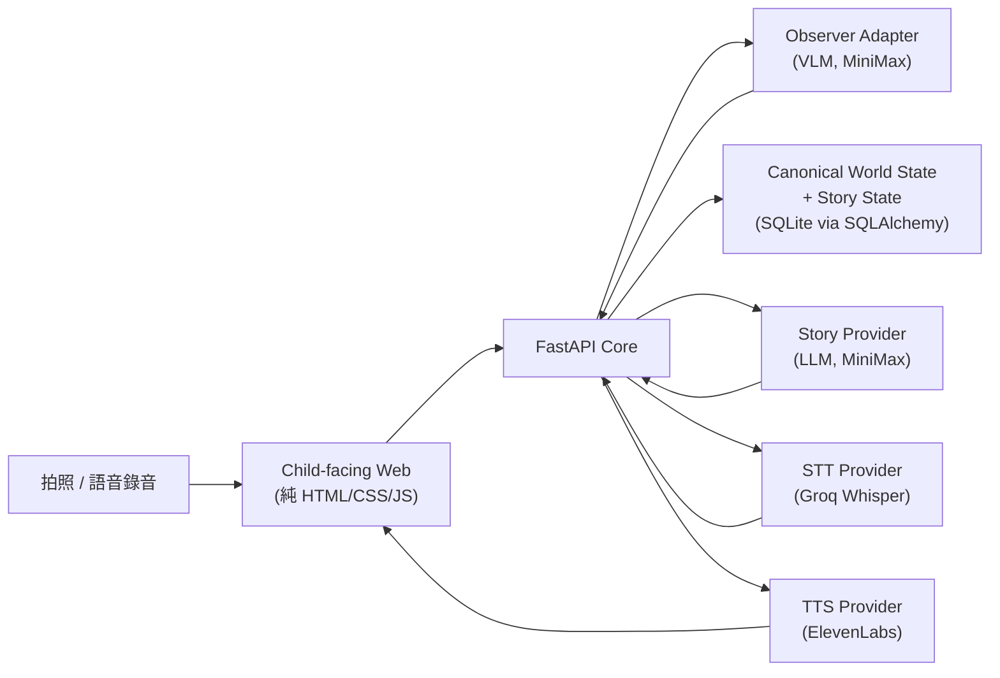

# 不對，不是這樣！給孩子主導的互動式AI故事夥伴


## 問題與目標

兒童除了學習使用 AI，更需要培養判斷、思考與協作能力，避免成為被動接受 AI 答案的使用者。

我們想解決的問題是：**讓孩童知道 AI 的觀察永遠只是「提案」，故事的世界與情節由孩子親自確認、修正、引導**。目標使用者是國小低、中年級的孩子；預期影響是讓孩子在使用 AI 說故事工具時，仍然保有對「這是不是我畫的東西」「接下來要發生什麼」的主導權，而不是被動接受 AI 一次生成的結果。

## 核心功能

- **拍照 → AI 觀察 → 孩子逐項確認**：孩子拍下畫作後，AI（視覺模型）提出候選觀察（有幾個人、什麼物件、什麼角色），孩子可以「對，就是這樣」「沒有這個東西」或「是其他東西」（打字或**語音輸入**）逐一確認，AI 的猜測在被確認前不會變成正式事實。
- **角色命名**：只要觀察裡出現「角色/生物」，會直接跳出命名畫面，讓孩子親自幫牠取名字，取代 AI 自己亂編的描述性稱呼。
- **孩子先給點子，AI 才動筆的接龍故事**：每一段故事都是先由孩子打字或用說的講出「接下來想發生什麼事」，AI 才根據這個點子寫一小段（最多兩句、不超過 50 字），孩子確認「對，就是這樣」才會定案，不滿意可以「不對，我要改寫」讓 AI 重新生成，不會直接把孩子打的字原封不動塞進故事。
- **系統互動提問跟故事本文分開**：AI 偶爾會問孩子一個小問題（例如「你猜牠會遇到誰呢？」），這個問題會被獨立解析出來、用不同顏色顯示，並附上 AI 建議的兩個簡短答案當按鈕，不會混進正式故事內容或完整故事播放。
- **語音輸入**：所有需要孩子打字的地方（取名字、確認觀察、故事點子、改寫）都可以改用「用說的」錄音，透過語音辨識轉成文字，跟打字走同一套流程與內容安全檢查。
- **文字轉語音朗讀**：故事段落與完整故事都可以按「唸給我聽」，交給 TTS 唸出來。
- **內容安全防護**：孩子輸入的文字（不論打字或語音辨識結果）都會先過濾明顯的色情、暴力字眼，命中就要求重新輸入，不會送進 AI。
- **不出戲的故事敘述**：畫作觀察裡常見的「手繪」「火柴人」「畫作」等會讓孩子意識到「這只是一張畫」的字眼，會在生成故事前被過濾／改寫，故事一律把畫裡的角色和物件當成真實存在的東西來敘述。

## 系統架構



前端是純 HTML/CSS/JS（無 build step），由後端 FastAPI 以同源 static file 的方式一起 serve，避免額外的 CORS 設定與部署複雜度。後端是單一 FastAPI 服務，內部區分「Core」與「Provider」兩層：

- **Core**：session、canonical world/story state、事件紀錄、樂觀鎖版本控制、語意比對（畫作新版本只詢問真正變化的部分）、故事草稿的生成與確認流程。這一層完全 provider-neutral，不知道實際用的是哪個 AI 服務。
- **Provider adapters**：實際打外部 AI 服務的地方（`services/api/src/child_agent_api/providers/`），包含 VLM 觀察、故事生成（MiniMax／GMI Cloud）、語音辨識（Groq）、語音合成（ElevenLabs）。Core 透過抽象介面呼叫這些 provider，替換底層模型不需要改動狀態機邏輯。

持久化用 SQLite（透過 SQLAlchemy + Alembic migration），公開部署時可切換成 Railway 的 persistent volume。

## 使用技術

| 類型 | 技術／服務 | 用途 |
| --- | --- | --- |
| AI 模型（VLM + 文字生成） | MiniMax（`MiniMaxAI/MiniMax-M3`，透過 GMI Cloud） | 觀察畫作內容、生成/重寫故事段落 |
| AI 模型（語音辨識） | Groq（`whisper-large-v3-turbo`） | 把孩子的語音輸入轉成文字 |
| 前端 | 純 HTML / CSS / JavaScript（無框架、無 build step） | 拍照互動介面、逐項確認 UI、故事閱讀畫面 |
| 後端 | Python 3.12、FastAPI、Pydantic、SQLAlchemy、Alembic | API 服務、canonical state 管理、資料持久化 |
| 語音合成 | ElevenLabs | 故事段落／完整故事的文字轉語音朗讀 |
| 字型 | BpmfGenSenRounded（Apache 2.0） | 前端中文圓體字型 |
| 部署 | Railway（Railpack） | 單一服務同時 serve API 與前端靜態檔案 |
| 開發工具 | uv、pytest、ruff、mypy | 套件管理、測試、lint、型別檢查 |

## 安裝與執行

需求：Python 3.12、[uv](https://docs.astral.sh/uv/)。前端是純 HTML/CSS/JS，不需要 Node.js。

```bash
# 1. 安裝相依套件
make setup

# 2. 設定環境變數（複製範本後填入你自己的金鑰）
cp .env.example .env
# 編輯 .env，至少需要：
#   GMI_API_KEY=      # MiniMax（觀察畫作 + 生成故事）
#   GROQ_API_KEY=     # 語音輸入（選填，沒設定就只能打字）
#   ELEVENLABS_API_KEY=  # 語音朗讀（選填）

# 3. 跑資料庫 migration
uv run --project services/api alembic -c services/api/alembic.ini upgrade head

# 4. 啟動服務（同時 serve API 與前端）
make dev-api
```

啟動後開啟 `http://localhost:8000` 即可使用；FastAPI 會同源掛載 `apps/web` 的靜態檔案，不需要另外啟動前端 dev server。

完整檢查（lint + 型別檢查 + 測試）：

```bash
make check
```

## 作品展示

- 作品展示網址：(https://child-production-8d25.up.railway.app)
- 評選影片：

## 限制與未來工作

**目前已知限制：**

- 語意觀察比對是 deterministic 規則式的（`added / changed / removed / unchanged / uncertain`），不是語意模型判斷，遇到 VLM 輸出的不常見詞彙可能需要持續擴充過濾清單（例如「手繪」「火柴人」類的出戲字眼）。
- 內容安全檢查是關鍵字比對，不是語意分類器，能擋住明顯的色情/暴力字眼，但換句話說法可能繞過，也可能有極少數誤判。
- AI 回傳格式（尤其是「問句 + 建議答案」的括號格式）並非嚴格結構化輸出，仰賴多種正則規則解析真實模型的不同輸出風格，遇到全新格式仍可能解析失敗。
- 目前沒有帳號系統與跨裝置/跨 session 的長期記憶，故事狀態僅存在單一 session 內。
- 尚未做完整的公開部署硬化（rate limit、AI 服務額度保護、更嚴謹的內容審核）。

**未來工作方向：**

- 補上「跳過此候選」以外更完整的畫作觀察互動選項。
- 為語意比對與內容安全檢查導入模型輔助判斷，降低規則式方法的漏網率。
- 補齊多故事情境下角色/世界狀態的匯出與續玩功能。
- 正式公開部署（Railway）與硬化（金鑰保護、額度控管、監控）。

## 第三方服務、資料與素材

| 項目 | 來源 | 授權／說明 |
| --- | --- | --- |
| MiniMax（`MiniMaxAI/MiniMax-M3`） | [GMI Cloud](https://console.gmicloud.ai/) 代管的推論服務 | 依 GMI Cloud 服務條款使用，需自行申請 API key（`GMI_API_KEY`），不隨程式碼提交 |
| Groq Whisper（`whisper-large-v3-turbo`） | [Groq API](https://console.groq.com/) | 依 Groq 服務條款使用，需自行申請 API key（`GROQ_API_KEY`），不隨程式碼提交 |
| ElevenLabs TTS | [ElevenLabs](https://elevenlabs.io/) | 依 ElevenLabs 服務條款使用，需自行申請 API key（`ELEVENLABS_API_KEY`），不隨程式碼提交 |
| BpmfGenSenRounded 字型 | [ButTaiwan/bpmfvs](https://github.com/ButTaiwan/bpmfvs)（`apps/web/fonts/`） | Apache License 2.0，授權全文與 NOTICE 已隨字型檔一併放在 `apps/web/fonts/` |
| Google Fonts（Nunito，僅作為西文字型 fallback） | [Google Fonts](https://fonts.google.com/) | Open Font License |

本作品不會、也不應該提交任何 API 金鑰、Token 或個人資料；所有金鑰皆透過環境變數（`.env`，已加入 `.gitignore`）設定。

## 團隊成員

| 姓名 | 分工 |
| --- | --- |
|  |  |
|  |  |

## License

本專案採用 **Apache License 2.0** 授權，詳細條款請見儲存庫根目錄的 [`LICENSE`](./LICENSE) 檔案。
