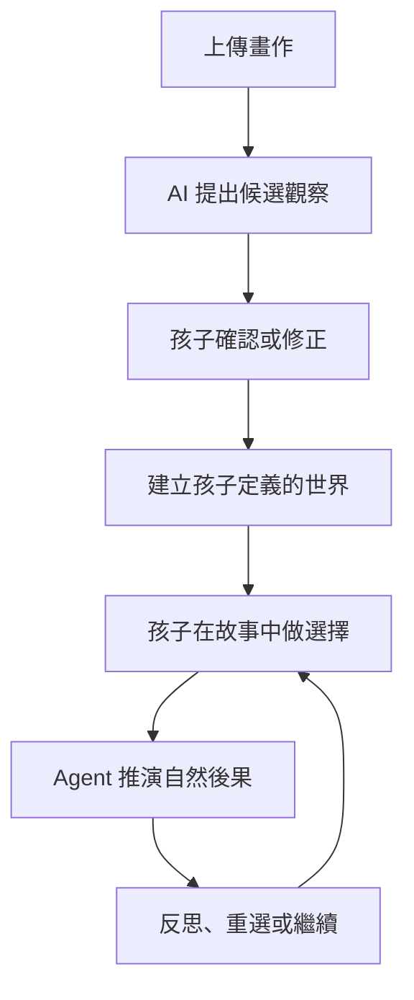

# Child-Grounded Story Agent

> AI 不替孩子解釋他的畫；AI 先問孩子，再把孩子自己定義的世界變成可以探索選擇與後果的故事。

Child-Grounded Story Agent 是一個以兒童畫作為起點的互動式 AI Agent 專案。視覺模型的輸出只是一組待確認的候選觀察；孩子確認、否定或補充後，系統才把資訊寫入故事世界。故事進行時，孩子的選擇會改變後續狀態，Agent 以自然後果和反思提問繼續互動，而不是判定答對或答錯。

## 核心互動



## MVP 要證明什麼

MVP 不以「生成一本漂亮故事書」為完成標準，而是要證明一條 stateful loop：

- AI 能把 observation 與 child-confirmed fact 分開保存。
- 孩子能修正 AI，且修正結果真的影響後續故事。
- 故事至少跨 3 個 scene 保持人物、物件與事件一致。
- 至少 2 次 child choice，其中 1 次會改變後續 scene。
- 非理想選擇以 consequence + reflection 呈現，不顯示「答錯」。
- 不從顏色、構圖或人物大小直接推論孩子的心理或醫療狀態。

## 專案狀態

目前是 **deterministic vertical slice** 階段：React 與 FastAPI 已跑通合成畫作、ball → balloon
修正、三個場景、兩次選擇與非評分結尾。流程只使用 repository fixture；尚未接入即時模型或真實媒體。
後端沿用 provider-neutral session、observation、world-state event/snapshot core，頁面重新整理時會從 API
依 persisted observation、world snapshot 與 immutable choice events 重建目前場景。

## 本機開發

需求：

- Node.js 24
- Python 3.12
- [uv](https://docs.astral.sh/uv/)

從乾淨的 checkout 安裝鎖定版本：

```bash
make setup
```

分別啟動 API 與 web：

```bash
uv run --project services/api alembic -c services/api/alembic.ini upgrade head
make dev-api
```

```bash
make dev-web
```

瀏覽器開啟 `http://localhost:5173`。若要改 API 網址，
將 `apps/web/.env.example` 複製為 `apps/web/.env.local`；若要改允許的 browser
origin，啟動 API 前設定 `CHILD_API_CORS_ORIGINS`。根目錄的
`.env.example` 集中列出所有可用變數。

### Deterministic fixture browser UAT

1. 先執行上面的 migration、`make dev-api` 與 `make dev-web`，開啟 `http://localhost:5173`。
2. 確認畫面一直顯示「合成資料・展示模式」，按「開始示範故事」。
3. 按「使用這張合成示範圖」，確認系統只把圓形物件暫時稱為球；此時重新整理，應回到同一張 grounding card。
4. 按「不是球，是四顆氣球」，確認過場文字與場景 1 都使用「氣球」；重新整理應回到場景 1。
5. 在場景 1 選「笑他抓不到氣球」，確認場景 2 顯示朋友安靜走到旁邊，沒有答錯或扣分文字；重新整理應回到場景 2。
6. 在場景 2 選「先在旁邊等一等」，確認到達場景 3 / 3 的結尾；重新整理應保持相同結尾。
7. 按「再開始一次」，確認回到 setup；也可另跑一次並在場景 1 選「問問朋友還好嗎」，比較場景 2 的不同敘事。

此 slice 的公開 API 為 `POST /v1/sessions`、`GET /v1/sessions/{id}`、
`POST /v1/sessions/{id}/fixture`、`POST /v1/sessions/{id}/grounding` 與
`POST /v1/sessions/{id}/choices`。Mutation body 都帶 `expected_state_version` 與
`idempotency_key`；重送相同 key 不重複推進，過期 version 回傳 `409 state_conflict`。

執行與 CI 相同的完整檢查：

```bash
make check
```

## 文件導覽

完整索引與文件狀態請見 [docs/README.md](docs/README.md)。

| 想了解的內容 | 文件 |
|---|---|
| 題目、設計理念與差異化 | [Concept](docs/CONCEPT.md) |
| 使用者流程、需求與範圍 | [Product spec](docs/PRODUCT_SPEC.md) |
| 系統元件、狀態機與部署邊界 | [Technical design](docs/TECHNICAL_DESIGN.md) |
| World state、scene 與 API 草案 | [Data contracts](docs/DATA_CONTRACTS.md) |
| Agent orchestration 與行為規則 | [Agent policy](docs/AGENT_POLICY.md) |
| 兒童安全、隱私與內容處理 | [Safety and privacy](docs/SAFETY_PRIVACY.md) |
| Demo 腳本、測試案例與指標 | [Demo and evaluation](docs/DEMO_EVALUATION.md) |
| 實作順序與 Issue backlog | [Implementation plan](docs/IMPLEMENTATION_PLAN.md) |
| 相鄰產品、研究與撞題分析 | [Prior art](docs/PRIOR_ART.md) |

## 核心產品原則

1. **Observation is not fact**：模型看見的內容，在孩子確認前不能成為故事事實。
2. **Meaning belongs to the child**：人物身分、關係、情緒與事件原因，以孩子的說法為優先。
3. **Consequence, not correctness**：以故事後果協助探索，不把社會情境簡化為標準答案。
4. **One orchestrated state machine**：MVP 使用單一 orchestrator 與結構化步驟，不堆疊互相聊天的 agents。
5. **No diagnosis from drawings**：本專案不是心理衡鑑、醫療診斷或治療工具。

## MVP 技術基線

- Web client：React、TypeScript 與 Vite；後續承接畫作上傳、確認卡片、選擇互動、語音／文字輸入與場景呈現。
- Python API：Python 3.12、FastAPI 與 Pydantic；後續承接 session、狀態機、provider adapters、安全檢查與事件紀錄。
- Model providers：VLM、LLM、STT、TTS 均經過介面隔離，可依延遲、成本與資料政策替換。
- Persistence：Hackathon 先以 SQLite + 檔案／物件儲存完成垂直切片；正式環境再更換持久層。
- Rendering：優先用既有 SVG、sprite、emoji 或固定動畫元件，不依賴逐 scene 生成影片。

技術方向仍以 [Technical design](docs/TECHNICAL_DESIGN.md) 與後續 ADR 為準。
