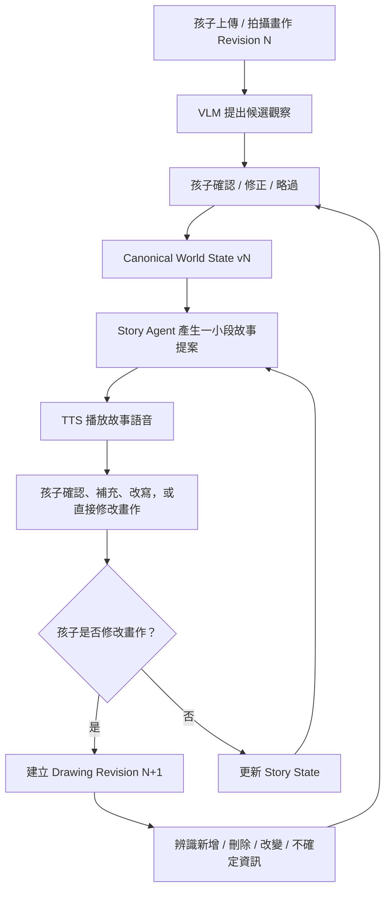
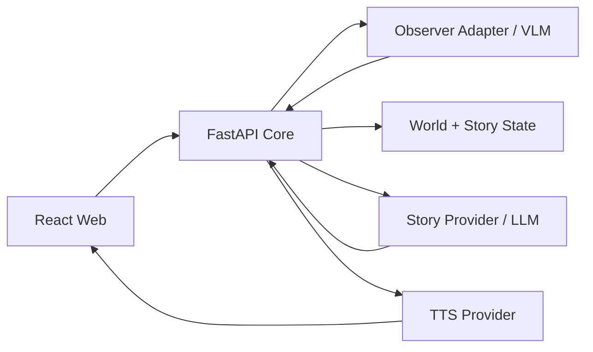

# Child-Grounded Story Agent

> 不是讓 AI 替孩子完成故事，而是讓故事跟著孩子的畫、說法與修正持續改變。

Child-Grounded Story Agent 是一個以兒童畫作作為持續互動介面的 AI 共創故事系統。AI 不一次決定完整故事，也不把視覺模型的判斷直接當成事實；系統會先提出可見內容的候選觀察，交由孩子確認、否定或修正，再把確認後的資訊寫入 canonical world state。

故事同樣採逐段生成。Agent 每次只提出一小段敘事，再讓孩子確認、補充、改寫，或直接修改原本的畫作。當畫作出現新的版本時，系統重新觀察變化、只追問真正有意義的新資訊，更新世界與故事狀態，再產生下一段故事與語音。核心目標是一個持續運作的 closed loop，而不是一次性的「看圖生故事」。

## 核心互動



## 兩層 Grounding

系統刻意把「AI 看懂了什麼」與「故事接下來怎麼走」分開確認。

### 1. Drawing grounding

VLM 只能提出 observation proposal，不能直接寫入孩子世界中的事實。

例如：

```text
AI observation: 4 balls
        ↓
Child correction: 不是球，是氣球
        ↓
Canonical world: 4 balloons
```

後續故事只能依照孩子確認後的 canonical world state 繼續。

### 2. Narrative grounding

AI 每次只生成一小段 story proposal，再讓孩子取得敘事主導權。

例如：

```text
AI proposal: 小明躲到樹下避雨
        ↓
Child correction: 不要，他拿出雨傘
        ↓
Canonical story state: 小明拿出雨傘
```

下一輪生成必須從更新後的 story state 繼續，而不是重新自由生成一個不一致的故事。

## 畫作 Revision 與閉回路

畫作不是一次性的 prompt，而是持續變化的世界狀態介面。

```text
Drawing R1
   ↓
Observation Batch 1
   ↓
World State v1
   ↓
Story Segment 1 + Audio 1
   ↓
Child edits drawing
   ↓
Drawing R2
   ↓
Semantic changes
   ↓
Selective grounding
   ↓
World State v2
   ↓
Story Segment 2 + Audio 2
   ↺
```

第二次觀察不以單純 pixel diff 為核心，而是比較「新 observation」與「目前 canonical state」的語意差異，例如：

```text
added:
- umbrella
- cloud

changed:
- person_2.expression: smile -> crying

removed:
- ball_3

uncertain:
- red object may be a flower
```

系統只需要對會影響故事、且仍不確定的變化再次詢問孩子；已確認且沒有改變的內容不必每輪重新確認。

## MVP 要證明什麼

MVP 不以「生成一本漂亮故事書」或「生成故事畫面」為完成標準，而是要證明一條可持續的 stateful closed loop：

- AI observation 與 child-confirmed fact 必須分開保存。
- 孩子能修正 AI，且修正結果真的影響後續故事。
- AI 逐段提出故事，而不是一次生成完整劇情。
- 孩子能透過確認、補充、修正或修改畫作改變後續故事。
- 新畫作 revision 能更新既有 world state，而不是每次重開一個全新故事。
- Story generator 只讀 canonical world/story state，不直接依賴未確認的 VLM raw output。
- 故事輸出以語音為主要體驗，畫面只保留必要的上傳、確認、修正與播放控制。
- 不從顏色、構圖、人物大小或表情直接推論孩子的心理、人格、發展或醫療狀態。

## 專案目前狀態

目前 `main` 已完成 **deterministic vertical slice**：React 與 FastAPI 已跑通合成畫作、ball → balloon 修正、world-state persistence、三個場景、兩次選擇與非評分結尾；頁面重新整理後會從 API 與 persisted state 恢復流程。

目前主線正在從 deterministic fixture 進入 provider integration。下一階段會把現有的 observer boundary 接到真實 VLM，再把原本的固定 branching demo 收斂成新的 closed-loop interaction：drawing revision、selective grounding、story state、短段故事生成與 TTS。

目前仍應清楚區分：

- 已完成：session / observation / world-state core、SQLite persistence、idempotency、versioning、deterministic browser loop。
- 進行中：provider-neutral observer、VLM safety/schema boundary、benchmark。
- 尚未完成：drawing revision reconciliation、canonical story state、逐段 story generation、正式 TTS integration、部署版 persistent storage。

## 系統邊界



幾個重要邊界：

1. VLM raw output 只能形成 proposal，不能直接變成 canonical state。
2. Story provider 只讀孩子已確認的 canonical state。
3. TTS 只負責把已確定要播放的故事文字轉成音訊，不擁有故事邏輯。
4. Provider-specific SDK、payload、model name 與 secret 都留在 adapter/configuration boundary，不進 domain model。

## 本機開發

需求：

- Node.js 24
- Python 3.12
- [uv](https://docs.astral.sh/uv/)

從乾淨的 checkout 安裝鎖定版本：

```bash
make setup
```

分別啟動 API 與 web：

```bash
uv run --project services/api alembic -c services/api/alembic.ini upgrade head
make dev-api
```

```bash
make dev-web
```

瀏覽器開啟 `http://localhost:5173`。若要改 API 網址，將 `apps/web/.env.example` 複製為 `apps/web/.env.local`；若要改允許的 browser origin，啟動 API 前設定 `CHILD_API_CORS_ORIGINS`。根目錄的 `.env.example` 集中列出所有可用變數。

### Deterministic fixture browser UAT

目前已完成的 deterministic slice 仍保留作為 regression / fallback path：

1. 執行 migration、`make dev-api` 與 `make dev-web`，開啟 `http://localhost:5173`。
2. 確認畫面顯示「合成資料・展示模式」，按「開始示範故事」。
3. 按「使用這張合成示範圖」，確認系統只把圓形物件暫時稱為球；此時重新整理，應回到同一張 grounding card。
4. 按「不是球，是四顆氣球」，確認後續內容都使用「氣球」；重新整理應保持目前狀態。
5. 完成兩次故事選擇並到達結尾，確認沒有答錯、扣分或道德分數文字。
6. 重新整理各階段，確認 session 與 state 都能由 API 恢復。
7. 按「再開始一次」，確認能建立新的流程而不污染前一個 session。

目前 deterministic slice 的公開 API 為 `POST /v1/sessions`、`GET /v1/sessions/{id}`、`POST /v1/sessions/{id}/fixture`、`POST /v1/sessions/{id}/grounding` 與 `POST /v1/sessions/{id}/choices`。Mutation body 都帶 `expected_state_version` 與 `idempotency_key`；重送相同 key 不重複推進，過期 version 回傳 `409 state_conflict`。

執行與 CI 相同的完整檢查：

```bash
make check
```

## 接下來的產品路線

1. 完成 provider-neutral VLM observer 與安全 / schema boundary。
2. 增加 drawing revision 與 semantic change reconciliation。
3. 實作 selective grounding，只追問新的、改變的或高語意不確定資訊。
4. 增加 canonical story state 與逐段 story proposal。
5. 把既有 ElevenLabs TTS prototype 整合成正式 `TTSProvider` boundary。
6. 完成「畫作 → 確認 → 故事語音 → 改畫 / 修正 → 狀態更新 → 下一段語音」browser UAT。
7. 再處理正式部署、external Postgres、private object storage 與 demo hardening。

## 部署方向

本機開發目前使用 SQLite。公開 demo 時不應依賴 serverless instance 的本地檔案持久化；目標架構會把 application state 與媒體分離：

- Web / API：Vercel 或等價的 HTTPS deployment。
- Persistent state：外部 Postgres。
- Drawing / audio assets：private object storage。
- VLM / LLM / TTS：全部透過 provider adapters 與環境變數配置。

實際 provider、storage 與 hosting 選型會在對應 decision gate 有 benchmark / UAT evidence 後再固定，不把供應商寫死在 domain logic。

## 文件導覽

完整索引與文件狀態請見 [docs/README.md](docs/README.md)。

| 想了解的內容 | 文件 |
|---|---|
| 題目、設計理念與差異化 | [Concept](docs/CONCEPT.md) |
| 使用者流程、需求與範圍 | [Product spec](docs/PRODUCT_SPEC.md) |
| 系統元件、狀態機與部署邊界 | [Technical design](docs/TECHNICAL_DESIGN.md) |
| World state、scene 與 API 草案 | [Data contracts](docs/DATA_CONTRACTS.md) |
| Agent orchestration 與行為規則 | [Agent policy](docs/AGENT_POLICY.md) |
| 兒童安全、隱私與內容處理 | [Safety and privacy](docs/SAFETY_PRIVACY.md) |
| Demo 腳本、測試案例與指標 | [Demo and evaluation](docs/DEMO_EVALUATION.md) |
| 實作順序與 Issue backlog | [Implementation plan](docs/IMPLEMENTATION_PLAN.md) |
| 相鄰產品、研究與撞題分析 | [Prior art](docs/PRIOR_ART.md) |

## 核心產品原則

1. **Observation is not fact**：模型看見的內容，在孩子確認前不能成為故事事實。
2. **Meaning belongs to the child**：人物身分、關係、事件原因與故事發展，以孩子的說法為優先。
3. **Story is proposed, not imposed**：AI 逐段提出敘事，孩子可以確認、修正、補充或改畫。
4. **State before generation**：下一段故事只能依目前 canonical world/story state 生成。
5. **Revision is interaction**：孩子修改畫作本身就是故事互動，不只靠按鈕選項。
6. **One orchestrated state machine**：MVP 使用單一 orchestrator 與結構化步驟，不堆疊互相聊天的 agents。
7. **No diagnosis from drawings**：本專案不是心理衡鑑、醫療診斷或治療工具。

## MVP 技術基線

- Web client：React、TypeScript、Vite。
- Python API：Python 3.12、FastAPI、Pydantic。
- Persistence：SQLite、SQLAlchemy、Alembic；部署版再替換為外部 persistent database。
- Model boundaries：VLM、LLM、STT、TTS 均透過 provider-neutral adapters 隔離。
- Story output：以短段文字 + TTS 語音為主，不把逐 scene AI 圖片 / 影片生成列為核心功能。
- Rendering：保留必要的畫作預覽、確認 / 修正 controls、播放控制與簡單狀態提示。

技術方向仍以 [Technical design](docs/TECHNICAL_DESIGN.md) 與後續 ADR / Issue 為準。
