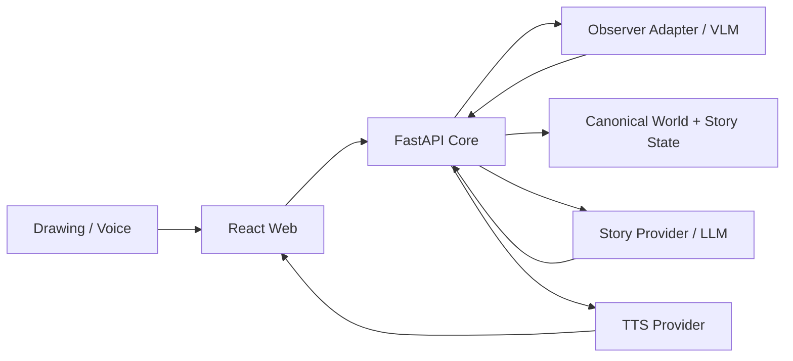

# Child-Grounded Story Agent

> **不是讓 AI 替孩子完成故事，而是讓故事跟著孩子的畫、說法與修正持續改變。**

Child-Grounded Story Agent 是一個以兒童畫作作為持續互動介面的 AI 共創故事系統。AI 不把視覺模型的判斷直接當成事實，也不一次生成完整故事；它先提出「我看到了什麼」與「故事接下來可能怎麼走」，再讓孩子確認、修正、補充，甚至直接修改原本的畫作。

系統把孩子確認過的內容保存成 **canonical world state** 與 **canonical story state**。下一次 AI 觀察或生成故事時，只能從這些已確認的狀態繼續，因此孩子的修正會真正影響後續敘事，而不是只變成下一輪 prompt 裡的一句話。

## Hackathon 核心主張

很多 AI storytelling 系統是：

```text
Drawing → AI → Story
```

我們要做的是一個持續運作的 child-grounded closed loop：

```text
Drawing Revision N
        ↓
VLM Observation Proposal
        ↓
Child Grounding
確認 / 修正 / 略過
        ↓
Canonical World State
        ↓
Short Story Proposal
        ↓
Child Grounding
接受 / 修正 / 改寫 / 改畫
        ↓
Canonical Story State
        ↓
TTS Story Audio
        ↓
Drawing Revision N+1 or Next Story Segment
        ↺
```

核心原則只有一句：

> **AI proposes; the child owns the world and story.**

## 為什麼不是「看圖生故事」

畫作不是一次性的 prompt，而是會持續變動的世界介面。

例如第一次 AI 把氣球看成球：

```text
AI observation: 4 balls
        ↓
Child correction: 不是球，是氣球
        ↓
Canonical world: 4 balloons
```

後面的故事只能使用 `balloon`。

之後孩子在原畫新增一隻狗，再上傳第二版：

```text
Drawing R1
- 4 people
- 4 balloons

Drawing R2
- 4 people
- 4 balloons
+ dog
```

系統不重新把整張圖當成全新故事，而是做 semantic reconciliation，保留已確認的氣球，只追問真正的新變化：

> 「我好像看到你新畫了一隻狗，是嗎？」

確認後，下一段故事才把狗帶進來。

## 兩層 Grounding

### Drawing grounding

VLM 只能建立 observation proposal，不能直接寫入 canonical world。孩子可以確認、修正、拒絕或略過。已確認且沒有改變的資訊不應每一輪重新詢問。

### Narrative grounding

Story Agent 每次只提出一小段 story proposal。孩子可以接受、修正故事細節、改寫發展，或直接修改畫作來改變世界。確認後才更新 canonical story state，再生成下一段。

## Hackathon MVP

比賽版不追求「生成一本完整故事書」，也不依賴生成故事圖片。只需要把以下閉回路跑穩：

1. AI 看畫並提出候選觀察。
2. 孩子可以糾正 AI，糾正會進入 canonical world state。
3. AI 從確認過的 world/story state 產生一小段故事。
4. 孩子可以接受、修正或改變故事方向。
5. 故事以 TTS 語音播放，文字作為 fallback。
6. 孩子可以修改原畫再上傳。
7. 新畫作只找出 `added / changed / removed / uncertain` 的語意變化。
8. 系統只詢問真正重要的新變化。
9. 下一段故事同時尊重先前修正與最新畫作變化。
10. Refresh / retry 不會遺失或重複已提交的狀態。

不做的事情同樣重要：不從兒童畫作推論心理疾病、人格或隱藏動機；不把 AI observation 當成真相；不靠 generated illustration / video / animation 當主要賣點；不把黑客松 scope 擴張成帳號平台或長期兒童 profile。

## 2–3 分鐘 Demo 劇本

1. 上傳第一版畫作。
2. AI：「我看到四個人和四顆球，對嗎？」
3. 孩子：「不是球，是氣球。」
4. 系統顯示 `ball → balloon ✓`。
5. 第一段故事真的使用「氣球」，並以語音播放。
6. 孩子修正一個故事發展，或在畫上新增一隻狗。
7. 上傳 Drawing Revision 2。
8. 系統只指出 `+ dog`，而不是重新詢問已確認的氣球。
9. 孩子確認狗。
10. 下一段故事出現狗，同時仍記得「氣球」與先前的故事修正。

這個流程就是 hackathon 的主要 **wow moment**。

## 協作方式：Core first, Integration second

為避免前端、模型與 state logic 同時開發時互相踩 code，專案分成兩個責任層。

### Core logic

Core 先完成，且必須能在沒有真實 VLM、TTS、STT 和 React UI 的情況下，用 deterministic fixtures / fake providers 驗證完整狀態流程。

Core 負責：

- session / event / version / idempotency；
- canonical world state；
- drawing revision；
- semantic reconciliation；
- selective grounding policy；
- canonical story state；
- narrative grounding；
- closed-loop orchestrator；
- provider-neutral contracts；
- FastAPI application/API boundary；
- persistence、migration 與 deterministic tests。

Core **不負責**：畫面設計、真實圖片上傳、camera、實際 VLM SDK、TTS/STT SDK、音訊播放或部署 UI。

### Frontend & multimodal integration

Core contracts 穩定後，再由 integration layer 接入：

- React child-facing UI；
- drawing upload / camera；
- live VLM adapter；
- ElevenLabs 或其他 TTS；
- optional STT；
- audio playback / replay；
- loading/error/fallback UX；
- browser UAT。

Integration layer 的規則是：**providers sense or render; the core decides state.** 前端和 provider 都不能建立第二套 canonical truth。

## 開發順序與 Issues

目前的執行鏈固定為：

1. [#8 — MVP-04: Observer adapter, safety boundary and VLM benchmark harness](https://github.com/futuremodeokok/child/issues/8)  
   Observer boundary foundation；目前 implementation PR 為 [#9](https://github.com/futuremodeokok/child/pull/9)，尚未視為 merged capability。

2. [#11 — CORE-01: Drawing revision, semantic reconciliation and selective grounding](https://github.com/futuremodeokok/child/issues/11)  
   純 core；不做 React、real VLM、TTS/STT。

3. [#12 — CORE-02: Canonical story state, narrative grounding and orchestration](https://github.com/futuremodeokok/child/issues/12)  
   純 core；用 fake StoryProvider 驗證兩段故事＋world revision 的 state continuity。

4. [#17 — INTEGRATION-01: Multimodal providers for VLM, TTS and optional STT](https://github.com/futuremodeokok/child/issues/17)  
   接真實 multimodal providers；不得改變 core state semantics。

5. [#18 — INTEGRATION-02: Child-facing React closed-loop demo UI](https://github.com/futuremodeokok/child/issues/18)  
   接前端、上傳、grounding interaction、audio UX 與 browser UAT。

6. [#13 — RELEASE-01: Public demo deployment and hackathon hardening](https://github.com/futuremodeokok/child/issues/13)  
   最後才處理 Vercel / backend hosting / persistent DB / media storage 與正式 rehearsal。

## 專案目前狀態

### 已完成並在 `main`

- React + TypeScript + Vite web scaffold。
- FastAPI backend。
- SQLite + SQLAlchemy + Alembic persistence。
- Session、Observation、World State、immutable events、state version、idempotency。
- `model_observation → child confirm/correct → canonical world` 核心不變量。
- Deterministic browser vertical slice。
- Ball → balloon 修正、三個場景、兩次選擇與 refresh recovery。

### 目前進行中

[#8](https://github.com/futuremodeokok/child/issues/8) / [PR #9](https://github.com/futuremodeokok/child/pull/9)：provider-neutral Observer、VLM schema/safety boundary、synthetic benchmark 與 adapter foundation。PR 尚未 merge，因此 README 不把它列為已完成能力。

## 系統邊界



重要邊界：

1. **Observation is not fact**：VLM raw output 只能形成 proposal。
2. **Child authority**：孩子的 confirm/correct/supply 優先於模型判斷。
3. **State before generation**：Story Provider 只能把 canonical state 當成權威資料來源。
4. **Story is proposed, not imposed**：AI 逐段提出，孩子可以改。
5. **Revision is interaction**：修改原畫本身就是故事互動。
6. **TTS owns no story logic**：語音 provider 只負責 rendering audio。
7. Provider-specific SDK、payload、model name 與 secret 不進 domain model。
8. React 不複製 canonical state machine，只呈現與提交 core API actions。

## 技術基線

- Web：React、TypeScript、Vite。
- API：Python 3.12、FastAPI、Pydantic。
- Persistence：SQLAlchemy、Alembic；本機 SQLite，公開部署改 external persistent DB。
- AI boundaries：VLM Observer、Story LLM、TTS 都透過 provider adapter 隔離。
- Deterministic fallback：repository-owned synthetic fixtures，不依賴外部模型即可跑 regression / rehearsal。

獨立 `dev` branch 已有 VLM / story generation / ElevenLabs TTS prototype，可作為 integration 參考；**不直接 merge 整支 unrelated-history `dev` branch**，需要的能力重新接入目前 FastAPI/domain boundary。

## 本機開發

需求：Node.js 24、Python 3.12、[uv](https://docs.astral.sh/uv/)。

```bash
make setup
uv run --project services/api alembic -c services/api/alembic.ini upgrade head
make dev-api
```

另一個 terminal：

```bash
make dev-web
```

開啟 `http://localhost:5173`。

完整 deterministic checks：

```bash
make check
```

## 部署方向

部署是最後一階段，不在 core 完成前提早綁死平台。

- Web：Vercel 優先。
- API：Vercel Python Functions 若實測可靠；否則小型外部 FastAPI backend。
- Persistent state：external Postgres。
- Drawing / audio：需要真實上傳時使用 private / short-lived object storage。
- Secrets：只放 server-side environment variables。

最終 hosting / storage 選型以 [#13](https://github.com/futuremodeokok/child/issues/13) 的實際 deployment evidence 為準。

## 文件導覽

- [Concept](docs/CONCEPT.md)
- [Product spec](docs/PRODUCT_SPEC.md)
- [Technical design](docs/TECHNICAL_DESIGN.md)
- [Data contracts](docs/DATA_CONTRACTS.md)
- [Agent policy](docs/AGENT_POLICY.md)
- [Safety and privacy](docs/SAFETY_PRIVACY.md)
- [Demo and evaluation](docs/DEMO_EVALUATION.md)
- [Implementation plan](docs/IMPLEMENTATION_PLAN.md)
- [Prior art](docs/PRIOR_ART.md)

## 一句話版本

> **AI 不一次決定完整故事，而是逐段提出畫作理解與故事發展；孩子透過確認、修正、語音／文字補充或直接修改畫作持續改變世界，系統再依孩子確認過的狀態繼續說下去。**
