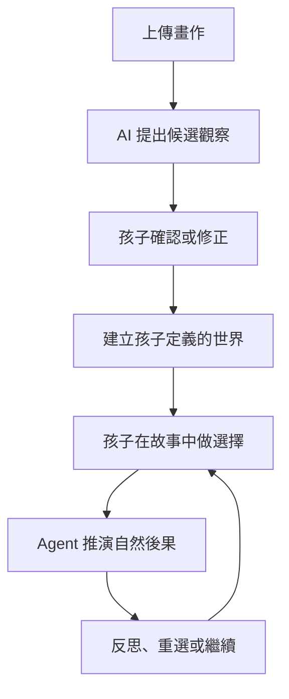

# Child-Grounded Story Agent

> AI 不替孩子解釋他的畫；AI 先問孩子，再把孩子自己定義的世界變成可以探索選擇與後果的故事。

Child-Grounded Story Agent 是一個以兒童畫作為起點的互動式 AI Agent 專案。視覺模型的輸出只是一組待確認的候選觀察；孩子確認、否定或補充後，系統才把資訊寫入故事世界。故事進行時，孩子的選擇會改變後續狀態，Agent 以自然後果和反思提問繼續互動，而不是判定答對或答錯。

## 核心互動

## MVP 要證明什麼

MVP 不以「生成一本漂亮故事書」為完成標準，而是要證明一條 stateful loop：

- AI 能把 observation 與 child-confirmed fact 分開保存。
- 孩子能修正 AI，且修正結果真的影響後續故事。
- 故事至少跨 3 個 scene 保持人物、物件與事件一致。
- 至少 2 次 child choice，其中 1 次會改變後續 scene。
- 非理想選擇以 consequence + reflection 呈現，不顯示「答錯」。
- 不從顏色、構圖或人物大小直接推論孩子的心理或醫療狀態。

## 專案狀態

目前是 **design / pre-implementation** 階段：產品定位、資料邊界、Agent policy、技術架構與 demo 驗證方式已形成文件；尚未把任何模型或框架標記為已實作。

## 文件導覽

完整索引與文件狀態請見 [docs/README.md](docs/README.md)。

| 想了解的內容 | 文件 |
|---|---|
| 題目、設計理念與差異化 | [Concept](docs/CONCEPT.md) |
| 使用者流程、需求與範圍 | [Product spec](docs/PRODUCT_SPEC.md) |
| 系統元件、狀態機與部署邊界 | [Technical design](docs/TECHNICAL_DESIGN.md) |
| World state、scene 與 API 草案 | [Data contracts](docs/DATA_CONTRACTS.md) |
| Agent orchestration 與行為規則 | [Agent policy](docs/AGENT_POLICY.md) |
| 兒童安全、隱私與內容處理 | [Safety and privacy](docs/SAFETY_PRIVACY.md) |
| Demo 腳本、測試案例與指標 | [Demo and evaluation](docs/DEMO_EVALUATION.md) |
| 實作順序與 Issue backlog | [Implementation plan](docs/IMPLEMENTATION_PLAN.md) |
| 相鄰產品、研究與撞題分析 | [Prior art](docs/PRIOR_ART.md) |

## 核心產品原則

1. **Observation is not fact**：模型看見的內容，在孩子確認前不能成為故事事實。
2. **Meaning belongs to the child**：人物身分、關係、情緒與事件原因，以孩子的說法為優先。
3. **Consequence, not correctness**：以故事後果協助探索，不把社會情境簡化為標準答案。
4. **One orchestrated state machine**：MVP 使用單一 orchestrator 與結構化步驟，不堆疊互相聊天的 agents。
5. **No diagnosis from drawings**：本專案不是心理衡鑑、醫療診斷或治療工具。

## 暫定技術方向

- Web client：畫作上傳、確認卡片、選擇互動、語音／文字輸入與場景呈現。
- Python API：session、狀態機、provider adapters、安全檢查與事件紀錄。
- Model providers：VLM、LLM、STT、TTS 均經過介面隔離，可依延遲、成本與資料政策替換。
- Persistence：Hackathon 先以 SQLite + 檔案／物件儲存完成垂直切片；正式環境再更換持久層。
- Rendering：優先用既有 SVG、sprite、emoji 或固定動畫元件，不依賴逐 scene 生成影片。

技術方向仍以 [Technical design](docs/TECHNICAL_DESIGN.md) 與後續 ADR 為準。

