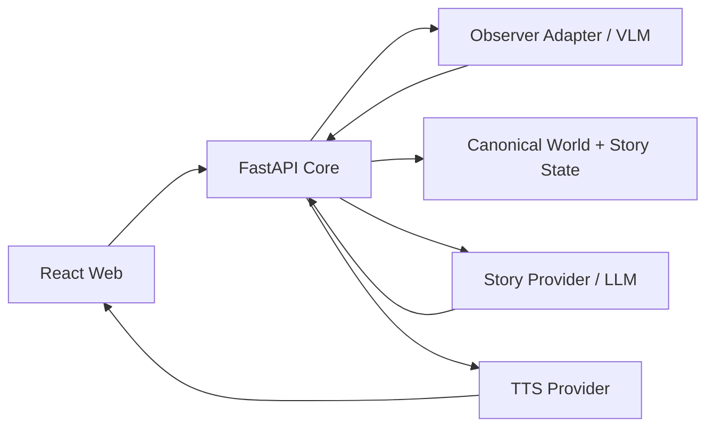

# Child-Grounded Story Agent

> **不是讓 AI 替孩子完成故事，而是讓故事跟著孩子的畫、說法與修正持續改變。**

Child-Grounded Story Agent 是一個以兒童畫作作為持續互動介面的 AI 共創故事系統。AI 不把視覺模型的判斷直接當成事實，也不一次生成完整故事；它先提出「我看到了什麼」與「故事接下來可能怎麼走」，再讓孩子確認、修正、補充，甚至直接修改原本的畫作。

系統把孩子確認過的內容保存成 **canonical world state** 與 **canonical story state**。下一次 AI 觀察或生成故事時，只能從這些已確認的狀態繼續，因此孩子的修正會真正影響後續敘事，而不是只變成下一輪 prompt 裡的一句話。

## Hackathon 核心主張

很多 AI storytelling 系統的流程是：

```text
Drawing → AI → Story
```

我們要證明的是一個持續運作的 child-grounded closed loop：

```text
Drawing Revision N
        ↓
VLM Observation Proposal
        ↓
Child Grounding
確認 / 修正 / 略過
        ↓
Canonical World State
        ↓
Short Story Proposal
        ↓
TTS Story Audio
        ↓
Child Grounding
確認 / 改寫 / 補充 / 改畫
        ↓
World / Story State Update
        ↓
Drawing Revision N+1 or Next Story Segment
        ↺
```

核心原則只有一句：

> **AI proposes; the child owns the world and story.**

## 為什麼不是「看圖生故事」

畫作不是一次性的 prompt，而是會持續變動的世界介面。

第一次，AI 可能把四顆氣球看成四顆球：

```text
AI observation: 4 balls
        ↓
Child correction: 不是球，是氣球
        ↓
Canonical world: 4 balloons
```

後面的故事只能使用 `balloon`。

接著 AI 只講一小段故事：

```text
AI proposal: 小明躲到樹下避雨
        ↓
Child correction: 不要，他拿出雨傘
        ↓
Canonical story state: 小明拿出雨傘
```

下一段不能又讓小明躲回樹下。

如果孩子之後真的在同一張畫新增一隻狗，再上傳第二版畫作：

```text
Drawing R1
- 4 people
- 4 balloons

Drawing R2
- 4 people
- 4 balloons
+ dog
```

系統應該只追問真正的新變化：

> 「我好像看到你新畫了一隻狗，是嗎？」

確認後，下一段故事才把狗帶進來。

這就是本專案要做的 **drawing revision → semantic reconciliation → selective grounding → state update → narrative continuation**。

## 兩層 Grounding

### Drawing grounding

VLM 只能建立 observation proposal，不能直接寫入 canonical world。

孩子可以：

- 確認；
- 修正；
- 拒絕；
- 略過、保持未知。

已確認且沒有改變的資訊不應每一輪重新詢問。

### Narrative grounding

Story Agent 每次只提出一小段 story proposal。

孩子可以：

- 接受並繼續；
- 修正故事細節；
- 補充新的發展；
- 直接修改畫作來改變世界。

確認後才更新 canonical story state，再生成下一段。

## Hackathon MVP 要證明什麼

MVP 不以「生成一本漂亮故事書」或「生成故事畫面」為完成標準。比賽版只需要把以下一條閉回路跑得穩：

1. AI 看畫並提出候選觀察。
2. 孩子可以糾正 AI，而且糾正會進入 canonical world state。
3. AI 從確認過的 world/story state 產生一小段故事。
4. 故事以 TTS 語音播放；不依賴生成故事圖片。
5. 孩子可以修正故事，或直接修改原畫再上傳。
6. 新畫作只找出 `added / changed / removed / uncertain` 的語意變化。
7. 系統只詢問真正重要的新變化。
8. 下一段故事同時尊重先前修正與最新畫作變化。
9. Refresh / retry 不會遺失或重複已提交的狀態。

不做的事情同樣重要：

- 不從兒童畫作推論心理疾病、人格、隱藏動機或道德特質；
- 不把 AI observation 當成孩子世界的真相；
- 不靠 generated illustration / video / animation 當主要賣點；
- 不把黑客松 scope 擴張成完整聊天平台、帳號系統或長期兒童 profile。

## 2–3 分鐘 Demo 劇本

我們希望評審看到的不是 API 串接，而是一個很明確的狀態改變：

1. 上傳第一版畫作。
2. AI：「我看到四個人和四顆球，對嗎？」
3. 孩子：「不是球，是氣球。」
4. 系統顯示 `ball → balloon ✓`。
5. 第一段故事語音真的使用「氣球」。
6. 孩子修正一個故事發展，或在畫上新增一隻狗。
7. 上傳 Drawing Revision 2。
8. 系統只指出 `+ dog`，而不是重新詢問已確認的氣球。
9. 孩子確認狗。
10. 下一段故事語音出現狗，同時仍然記得「氣球」與先前的故事修正。

這個流程就是 hackathon 的主要 **wow moment**。

## 專案目前狀態

### 已完成並在 `main`

- React + TypeScript + Vite web client。
- FastAPI backend。
- SQLite + SQLAlchemy + Alembic persistence。
- Session、Observation、World State、immutable events、state version、idempotency。
- `model_observation → child confirm/correct → canonical world` 的核心不變量。
- Deterministic browser vertical slice。
- Ball → balloon 修正、三個場景、兩次選擇與 refresh recovery。

### 目前進行中

[MVP-04 / Issue #8](https://github.com/futuremodeokok/child/issues/8)：provider-neutral Observer、VLM schema/safety boundary、synthetic benchmark 與 real-provider adapter。對應 implementation PR 為 [PR #9](https://github.com/futuremodeokok/child/pull/9)，**尚未視為 merged capability**。

### 接下來三個 Hackathon Issues

1. [#11 — Drawing revision closed loop and selective grounding](https://github.com/futuremodeokok/child/issues/11)
2. [#12 — Incremental story state, narrative grounding and TTS loop](https://github.com/futuremodeokok/child/issues/12)
3. [#13 — Public demo deployment and hackathon hardening](https://github.com/futuremodeokok/child/issues/13)

詳細順序見 [Implementation plan](docs/IMPLEMENTATION_PLAN.md)。

## 系統邊界



重要邊界：

1. **Observation is not fact**：VLM raw output 只能形成 proposal。
2. **Child authority**：孩子的 confirm/correct/supply 優先於模型判斷。
3. **State before generation**：Story Provider 只能把 canonical state 當成權威資料來源。
4. **Story is proposed, not imposed**：AI 逐段提出，孩子可以改。
5. **Revision is interaction**：修改原畫本身就是故事互動。
6. **TTS owns no story logic**：語音 provider 只把已確定要播放的文字轉成音訊。
7. Provider-specific SDK、payload、model name 與 secret 不進 domain model。

## 技術基線

- Web：React、TypeScript、Vite。
- API：Python 3.12、FastAPI、Pydantic。
- Persistence：SQLAlchemy、Alembic；本機 SQLite，公開部署改 external persistent DB。
- AI boundaries：VLM Observer、Story LLM、TTS 都透過 provider adapter 隔離。
- Deterministic fallback：repository-owned synthetic fixtures，不依賴外部模型即可跑 regression / rehearsal。

朋友在獨立 `dev` branch 已有 VLM / story generation / ElevenLabs TTS prototype，可作為 provider integration 的參考；**不直接 merge 整支 unrelated-history `dev` branch**，需要的能力會重新接入目前 FastAPI/domain boundary。

## 本機開發

需求：Node.js 24、Python 3.12、[uv](https://docs.astral.sh/uv/)。

```bash
make setup
uv run --project services/api alembic -c services/api/alembic.ini upgrade head
make dev-api
```

另一個 terminal：

```bash
make dev-web
```

開啟 `http://localhost:5173`。

執行完整 deterministic checks：

```bash
make check
```

### 已完成 deterministic UAT

目前 `main` 的 fixture path 仍保留作 regression / demo fallback：

1. 建立 session。
2. 使用明確標示的 synthetic drawing fixture。
3. AI proposal 為 `ball`。
4. 孩子修正為 `balloon`。
5. 後續 deterministic story 使用 `balloon`。
6. 完成兩次選擇到達非評分結尾。
7. 各階段 refresh 能由 server-side persisted state 恢復。

目前公開 API 包含 `POST /v1/sessions`、`GET /v1/sessions/{id}`、`POST /v1/sessions/{id}/fixture`、`POST /v1/sessions/{id}/grounding`、`POST /v1/sessions/{id}/choices`。Mutation 使用 `expected_state_version` 與 `idempotency_key` 保護重送與 stale writes。

## 部署方向

公開 Hackathon demo 的目標不是 production-scale 架構，而是可靠的 HTTPS closed-loop demo：

- Web：優先考慮 Vercel。
- API：若 FastAPI 在 Vercel serverless boundary 足夠可靠則同平台；否則採小型外部 backend。
- Persistent state：external Postgres。
- Drawing / audio：需要真實上傳時使用 private / short-lived object storage。
- Secrets：只放 server-side environment variables。

最終 hosting / storage 選型以 #13 的實際 deployment evidence 為準。

## 文件導覽

- [Concept](docs/CONCEPT.md)
- [Product spec](docs/PRODUCT_SPEC.md)
- [Technical design](docs/TECHNICAL_DESIGN.md)
- [Data contracts](docs/DATA_CONTRACTS.md)
- [Agent policy](docs/AGENT_POLICY.md)
- [Safety and privacy](docs/SAFETY_PRIVACY.md)
- [Demo and evaluation](docs/DEMO_EVALUATION.md)
- [Implementation plan](docs/IMPLEMENTATION_PLAN.md)
- [Prior art](docs/PRIOR_ART.md)

## 一句話版本

> **AI 不一次決定完整故事，而是逐段提出畫作理解與故事發展；孩子透過確認、修正、語音／文字補充或直接修改畫作持續改變世界，系統再依孩子確認過的狀態繼續說下去。**
