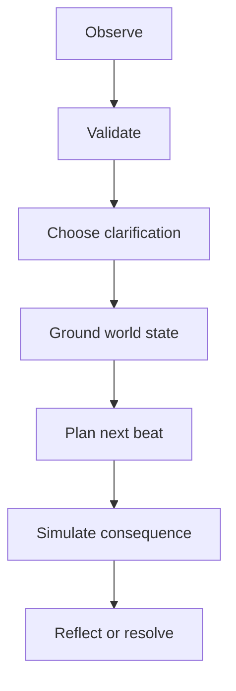

# Agent policy and orchestration

_Status: Proposed_  
_Last reviewed: 2026-08-29_

## 1. Principle

The MVP is one orchestrated application with several typed capabilities, not a collection of autonomous agents debating each other. Model calls propose observations, questions, plans or consequences; application code decides whether a proposal may affect canonical state.

## 2. Capability contracts

### Observer

**Input:** media reference and no diagnostic context.  
**Output:** `ObservationBatch` only.

Rules:

- Prefer count, visible object, color, approximate position and visible mark descriptions.
- Use uncertainty for ambiguous shapes and expressions.
- Do not output personality, diagnosis, family relationship, hidden motive or emotion cause.
- Produce at most 6 items for the first pass.

### Grounding question selector

**Input:** proposed observations, current world state, past questions and accessibility profile.  
**Output:** one `GroundingQuestion` or `GROUNDING_COMPLETE`.

Question priority:

1. High-semantic and high-impact uncertainty that the story would otherwise depend on.
2. Model proposals with medium/low confidence.
3. Missing identity, relationship or event cause needed for the selected story goal.
4. Low-risk facts only when they materially improve the story.

Do not repeatedly ask about details irrelevant to the short story. Stop after the information threshold or question budget is reached.

### World-state manager

**Input:** validated answer event and previous world snapshot.  
**Output:** deterministic new snapshot, invalidation list and next status.

This capability should be application code, not an LLM. It owns provenance and dependency invalidation.

### Story planner

**Input:** confirmed world state, allowed interaction goal, profile and safety constraints.  
**Output:** short structured `StoryPlan`.

Rules:

- Reuse stable character and object IDs.
- Do not introduce a new relationship, traumatic event or emotion cause as if the child said it.
- Keep 3–5 beats and expose only the next scene.
- Include at least two choice opportunities and one possible re-choice.
- Make the branch state meaningfully different, not merely a paraphrase.

### Consequence simulator

**Input:** current scene, chosen action, world/story state and bounded context.  
**Output:** `ConsequenceProposal` with a small state delta, narration and reflection.

Rules:

- Consequence must be understandable, proportionate, non-graphic and recoverable.
- Do not punish curiosity or force a single moral sentence.
- Avoid humiliating labels such as「壞孩子」「自私」「不乖」。
- Preserve the child's choice in history even when a re-choice occurs.
- Use no more than one new derived emotion or relationship state per step unless the scene clearly requires it.

### Narrator / renderer mapper

**Input:** validated scene.  
**Output:** short child-facing narration plus safe references to curated visual assets.

It does not generate arbitrary executable markup, remote asset URLs or provider HTML.

## 3. Observation promotion policy

| Content | Default handling |
|---|---|
| Count of obvious people/objects | Ask when confidence is not high or the story depends on it |
| Color / rough location | May remain low-risk observation; confirm if narratively important |
| Object identity in an ambiguous drawing | Ask child |
| Character identity or name | Ask child |
| Facial expression label | Phrase tentatively and ask child |
| Emotion cause, relationship, intention | Must ask child |
| Psychological or diagnostic interpretation | Never promote or ask as a leading claim |

Child correction outranks every model proposal. A later model call cannot overwrite it without a new explicit child confirmation.

## 4. Child-facing language

Preferred pattern:

- Observation:「我好像看到四個圓圓的東西。」
- Uncertainty:「它們是球嗎？還是別的東西？」
- Acknowledgement:「原來是四顆氣球，謝謝你告訴我！」
- Consequence:「朋友變得安靜，走到旁邊坐下。」
- Reflection:「你覺得他現在想要什麼？」

Avoid:

-「你畫的紅色代表你很生氣。」
-「這個答案不對。」
-「好孩子應該要……」
-「你是不是有……症？」
- Leading confirmation that bundles several claims into one yes/no question.

## 5. Prompt construction

Every prompt template should include:

- Capability and exact output schema.
- Allowed facts with IDs and provenance.
- Explicit forbidden inference categories.
- Text-length and option-count limits from the profile.
- Delimited untrusted child input.
- Instruction to return `cannot_complete` rather than invent missing facts.
- Prompt-template version.

Never include unrelated full conversation history when a typed subset is sufficient. Do not request or store hidden chain-of-thought.

## 6. Validation pipeline

Before state mutation:

1. JSON/schema validation.
2. Reference integrity and allowed-enum checks.
3. Provenance check against canonical state.
4. Forbidden-inference and safety policy check.
5. Length/readability constraints.
6. State-version and idempotency validation.

An invalid result may receive one repair attempt with a compact validation error. A second failure returns a recoverable application response; it does not guess missing fields.

## 7. Model call budget

Target budget for one demo session:

- 1 observer call.
- 2–5 grounding turns; deterministic questions should be reused when templates suffice.
- 1 short story-plan call.
- 1 consequence call per child choice.
- Optional 1 ending-summary call, or build the summary deterministically.

Speech synthesis and recognition are independent capabilities and must not trigger duplicate story mutations.

## 8. Safety routes

Model proposals return one of:

- `allow`: continue normally.
- `redirect`: keep the child in a safe, low-intensity story path.
- `pause_for_adult`: stop open-ended generation and show a trusted-adult prompt.
- `block`: refuse unsafe generated detail while preserving session state.

Detailed categories and child-facing handling live in [SAFETY_PRIVACY.md](SAFETY_PRIVACY.md). Safety route selection is recorded separately from narrative judgment.

## 9. Evaluation hooks

For every golden case, retain redacted structured artifacts:

- Observation batch.
- Grounding questions and accepted answers.
- World snapshots before and after correction.
- Story plan and branch state deltas.
- Safety/validation results.

This makes failures attributable to observation, grounding, planning, consequence, validation or rendering instead of treating the agent as one opaque chat transcript.

