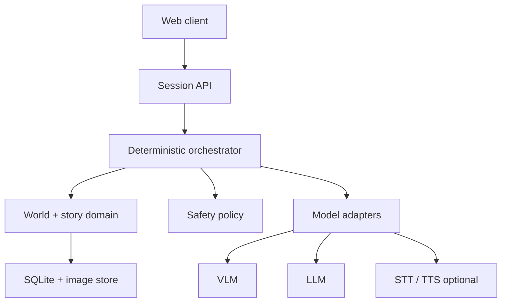
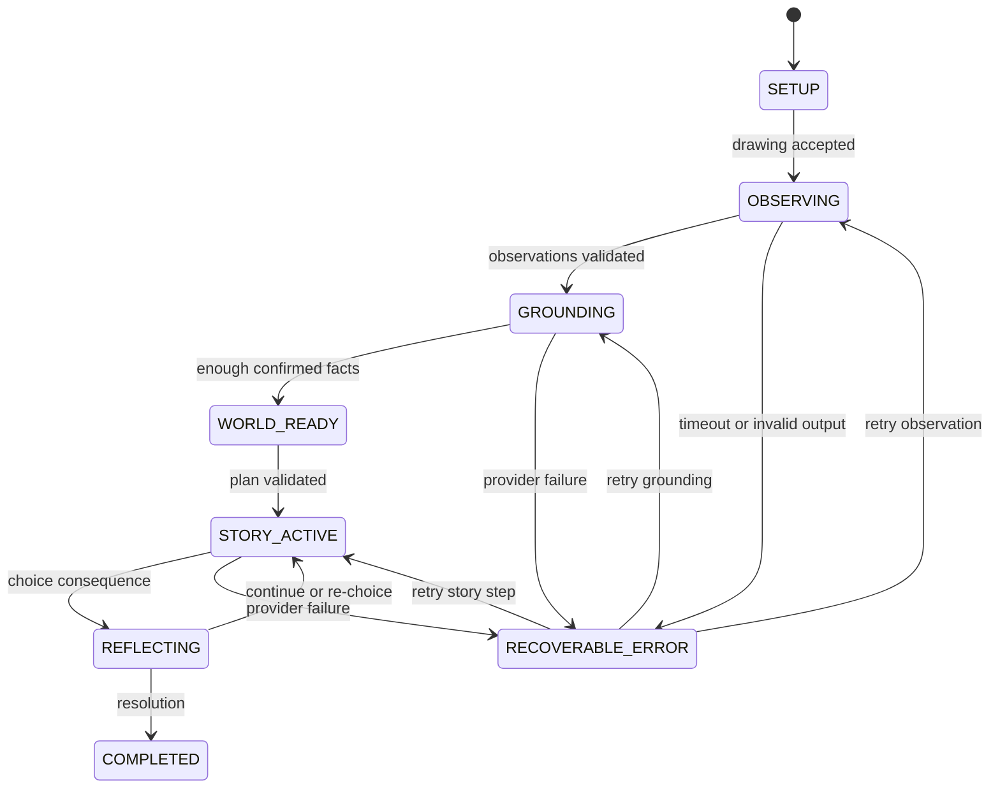

# Technical design

_Status: Proposed_  
_Last reviewed: 2026-08-29_

## 1. Design goals

- 用一條可觀察、可測試的 state machine 跑通 Observe → Clarify → Ground → Simulate → Reflect。
- 讓 vision / language / speech provider 可替換，不讓 domain model 綁死單一 API。
- 將模型生成限制在結構化 proposal；canonical state 只由驗證過的 application code 更新。
- 在模型失敗、重試或使用者重整時，保留已確認的孩子輸入。
- 把兒童安全與 provenance 當成 domain requirement，不是最後才加的 prompt。

## 2. Recommended MVP architecture



### Baseline stack

| Layer | MVP baseline | Why |
|---|---|---|
| Web | React-based client; framework decided by frontend owner | Componentized confirmation cards and scene renderer |
| API | Python 3.12 + FastAPI + Pydantic | Typed contracts and straightforward model integration |
| Orchestration | Application-owned state machine | Predictable transitions; no large agent framework required |
| Persistence | SQLite for session/event data | Simple local demo, transactional writes, replaceable later |
| Image storage | Local private directory in dev; object-store adapter in deploy | Avoid image bytes in relational rows |
| Rendering | Curated SVG / sprite / emoji components | Stable latency and controllable child-facing output |
| Realtime | Start with request/response + optional SSE progress | WebSocket only if interaction evidence requires it |

Model names and vendors remain a decision gate. Choose them after a small spike measures drawing recognition, structured-output validity, latency, cost, regional availability and child-data policy.

## 3. Component responsibilities

| Component | Owns | Must not own |
|---|---|---|
| Web client | Input capture, accessible cards, scene rendering, local media playback | Canonical world-state rules or hidden model prompts |
| Session API | Auth/session boundary, validation, idempotency, response shaping | Story reasoning inside route handlers |
| Orchestrator | Next action, transition order, retry policy, tool budget | Provider-specific SDK types |
| Observer adapter | Image → observation proposals | Promoting observations to facts |
| Grounding policy | Which uncertainty to ask next | Interpreting child psychology |
| World-state service | Provenance, corrections, invalidation, consistency | Free-form narrative generation |
| Story planner | Proposed beats based on allowed facts | Direct state mutation |
| Consequence simulator | Proposed bounded outcome and reflection | Correctness scores or diagnoses |
| Safety policy | Input/output classification and response route | Silently rewriting confirmed child meaning |
| Repository | Sessions, events, snapshots, media references | Raw provider objects as domain state |

## 4. Session state machine



`BLOCKED` is an orthogonal safety outcome. It records a safe child-facing response and adult-action flag without deleting the last valid state.

## 5. End-to-end sequence

1. API creates `session_id` and accessibility profile.
2. Drawing upload is validated, stored privately and recorded as a media reference.
3. Observer adapter returns a versioned `ObservationBatch`.
4. Application validates schema, applies forbidden-inference rules and stores proposals.
5. Grounding policy selects the highest-value safe question.
6. Child answer is appended as an immutable event; world-state service derives a new snapshot.
7. When required facts are sufficient, story planner proposes a short plan.
8. Validator rejects plan elements without allowed provenance or inconsistent identities.
9. Client renders one scene. A choice submission carries an idempotency key and expected state version.
10. Consequence simulator proposes state delta + narration + reflection; application validates and commits both event and new snapshot transactionally.
11. Ending renderer builds a summary from stored state, not from reconstructed chat history.

## 6. Key invariants

- `observation.status != confirmed` cannot be read through the confirmed-fact query path.
- Every world fact has `source`, `source_ref`, `created_at` and `version`.
- A correction creates a new event; it does not erase audit history.
- Derived facts record dependencies. Correcting a dependency marks them stale before another scene is generated.
- Only one accepted transition may advance a session version from `n` to `n + 1`.
- Model output never directly supplies database IDs, storage paths or authorization fields.
- The current scene and story plan reference stable character/object IDs, not display names alone.

## 7. Structured model calls

Each model call receives the minimum necessary state and returns a schema-constrained proposal. The application must:

1. Parse against a versioned Pydantic model.
2. Reject unknown enum values and oversized text.
3. Run provenance and safety validators.
4. Retry once with validation feedback when safe.
5. Fall back to a deterministic recovery response instead of mutating state from invalid JSON.

Raw chain-of-thought is neither requested nor stored. Store request metadata, prompt-template version, provider/model identifier, duration, token/cost counters when available, validation outcome and redacted error.

## 8. Failure and retry behavior

| Failure | User-facing behavior | State behavior |
|---|---|---|
| Image invalid | Ask adult to choose another image | No session advance |
| Observer timeout | Show retry; preserve drawing | Same version, attempt event only |
| Invalid model JSON | Automatic one-time repair, then retry option | No canonical mutation |
| Duplicate answer / choice | Return previously committed result | Idempotent response |
| Stale client version | Refresh current scene | Reject conflicting mutation |
| Safety block | Pause open story and show bounded safe response | Preserve last valid snapshot + safety event |
| Renderer failure | Use text + static fallback | Story state remains valid |

## 9. Suggested repository layout

```text
apps/
  web/
services/
  api/
    app/
      api/
      domain/
      orchestration/
      providers/
      safety/
      persistence/
    tests/
      unit/
      contract/
      integration/
      fixtures/
docs/
```

If the team chooses a smaller layout, preserve the component boundaries even when modules live in fewer directories.

## 10. Observability

Minimum per-step telemetry:

- `session_id` pseudonymous identifier and state version.
- transition name and outcome.
- provider call duration, validation result and retry count.
- grounding question count.
- correction count and invalidation count.
- branch choice and scene ID.
- safety route without storing unnecessary child text.

Logs must not include original image bytes, raw audio or full transcript by default.

## 11. Deployment boundary

For a public demo:

- Serve over HTTPS.
- Keep API credentials only on the server.
- Restrict uploaded media from public URLs.
- Configure explicit media retention and deletion.
- Rate-limit session creation and model calls.
- Disable debug endpoints and raw prompt display.
- Confirm each third-party provider's data-use settings before using real child data.

## 12. Decisions still required

1. Frontend framework and deployment owner.
2. VLM/LLM provider after benchmark spike.
3. Whether voice is MVP P0 or P1.
4. Storage adapter and retention in deployed demo.
5. SSE progress or plain request/response.

Record accepted choices as ADRs; do not silently treat this proposal as implementation fact.

